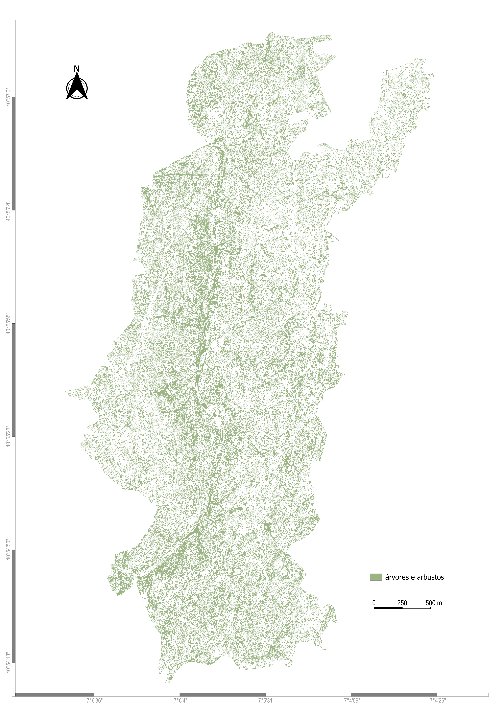
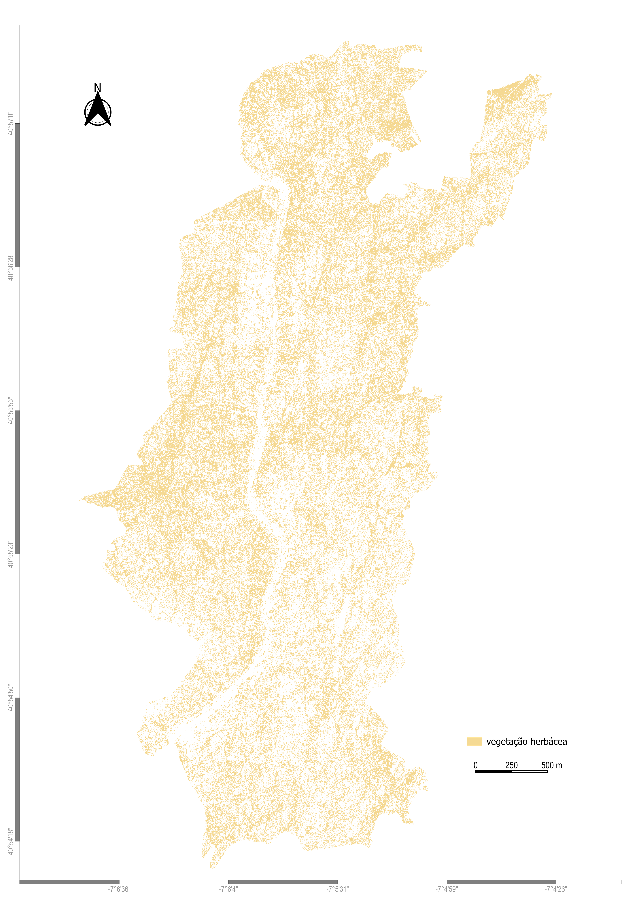
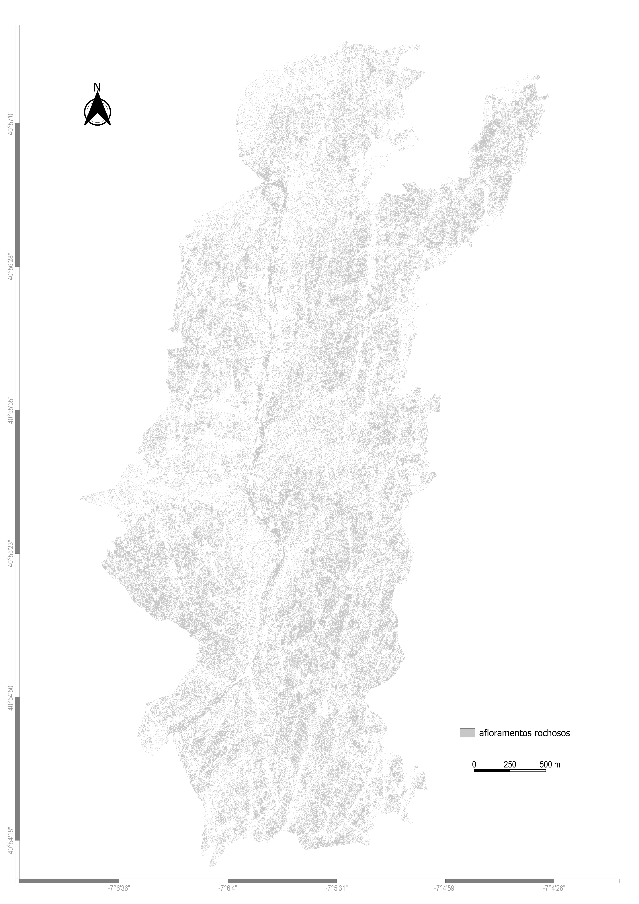

# Land Cover Maps — Faia Brava Reserve

This folder contains all cartographic outputs generated during the land use/land cover (LULC) classification of the Faia Brava Reserve.  
The maps are derived from the best-performing workflow identified in the dissertation and include both the **final classification map** and **individual class maps** for detailed interpretation.

These visual outputs allow users to understand the spatial distribution of each land-cover class and to validate the classification results visually.

---

## 1. Final LULC Map over Orthoimage

**Why this map is included:**  
- It provides the **complete overview** of the classification result.  
- Shows how well the model aligns with the underlying landscape.  
- Useful for stakeholders, ecologists, and managers who need a holistic spatial representation.

**Description:**  
This map represents the full classification applied over the orthophoto of the Faia Brava Reserve using the best-performing workflow  
(**Random Forest + UAV RGB + GLI + Entropy**).  
The base orthophoto allows visual validation and ensures intuitive understanding of boundaries and transitions between classes.

---

## 2. Class-Specific Maps (One map per land-cover class)

These maps isolate each land-cover class, highlighting its spatial extent.  
They follow the same organization as the annexes of the dissertation.

---

### **2.1. Trees & Shrubs**

**Purpose:**  
Shows the distribution of woody vegetation, a dominant component of the Faia Brava landscape.

---

### **2.2. Herbaceous Vegetation**

**Purpose:**  
Highlights areas dominated by low vegetation, relevant for grazing analysis and seasonal monitoring.

---

### **2.3. Rocky Outcrops**

**Purpose:**  
Represents exposed rock formations, important for ecological structure and habitat classification.

---

### **2.4. Other Land Uses**

**Purpose:**  
Includes small patches of anthropogenic or non-vegetated areas (paths, bare soil, etc.).

---

## 3. Notes

- All maps in this folder correspond to the final classified output.  
- The coordinate reference system is the same used in the dissertation (PT-TM06 / ETRS89 unless otherwise specified).  
- Raster datasets (UAV orthomosaics, Pléiades imagery) are **not included** due to GitHub size limitations.

---

## 4. Full Dissertation

For full methodology, sampling strategy, preprocessing, accuracy metrics, and validation details, refer to:

📄 `Dissertation/Dissertacao.pdf`

---

